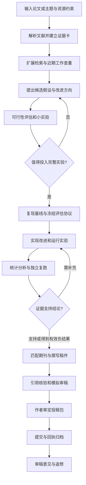

# 从论文与主题到实验、写作和投稿的科研工作流

**结论：计算机、AI 和数据科学领域已经有可下载的科研自动化项目，能把文献、点子、代码实验、结果分析和论文草稿串起来。最接近完整产品流程的是 AutoResearchClaw；最适合在已有编码代理上逐步定制的是 ARIS；最适合研究端到端科研代理架构的是 AI-Researcher、AI Scientist 和 InternAgent。尚不能据此承诺“任意主题自动产出可靠创新、准确预测期刊等级、无人负责地完成发表”。**

建议先选一个主流程，完成一项小规模研究的可复现实验，再扩展为长期科研工作台。关键建设对象是证据、实验评估和持续状态，而不只是写论文的提示词。

覆盖范围为计算机／AI／数据科学，检索截至 2026 年 9 月 10 日。这里的“广泛调研”指覆盖主要端到端系统、关键组件、原始论文和投稿规则，不代表穷尽全网所有仓库与文章。公开 README 的功能声明、作者实验、外部复现和本报告的工程建议分别看待；没有对下列系统做本机安装或 GPU 实测，不给出实测性能排名。

**选型速览**

| 需求 | 优先考察 | 判断 |
|---|---|---|
| 先体验主题到论文的完整链路 | AutoResearchClaw | 阶段和交付物清晰；仍须验证实验与引用 |
| 给现有 AI 编码助手增加科研流程 | ARIS | 轻量、可改造，实际可靠性取决于执行器与约束 |
| 研究科研代理，或做较重的自主 ML 研究 | AI-Researcher、AI Scientist v2、InternAgent | 架构与论文可参考，适配和算力成本较高 |
| 已有论文代码，希望自动尝试改进 | autoresearch 思路、Curie、R&D-Agent、AIDE | 先把评估目标做可靠，再放开自动迭代 |
| 主要是读文献、找证据 | PaperQA、Ai2 Scholar QA、OpenScholar | 不能单独承担实验和发表 |
| 预测投稿层级 | 自建候选期刊匹配模块 | 提供有证据的目标梯队与缺口，不伪造录用概率 |

表中优先级是针对个人科研工作流的工程判断，并非统一基准测试结果。项目事实分别见下列原始仓库。

**一、现有项目地图**

下表的“缺口”表示该工具不能单独满足整个目标，不等于工具本身有缺陷。仓库公开也不自动代表代码、权重、数据和所用 API 全部免费或拥有相同许可证。

| 项目及原始来源 | 主要覆盖 | 对本需求的价值 | 限制与选型意见 |
|---|---|---|---|
| [AutoResearchClaw](https://github.com/aiming-lab/AutoResearchClaw) | 主题、检索、假设、实验、分析、审阅、LaTeX | 最接近可直接试用的主流水线；支持人工参与模式 | 文档的“conference-ready”是交付格式与流程声明，不能当成录用证据 |
| [ARIS 上游](https://github.com/wanshuiyin/Auto-claude-code-research-in-sleep) | 文献、点子、实验、交叉审阅、写作 | 以 Markdown skills 组织工作，适合逐步定制 | 依赖编码代理、模型、服务器；“轻量”不代表完整研究零依赖 |
| [AI-Researcher](https://github.com/HKUDS/AI-Researcher) | 文献探索、创新实现、实验、论文 | 有 Scientist-Bench 和较完整研究实现 | 系统论文的 NeurIPS 标记不能转化为生成论文的录用保证；代码与商业服务分开评估 |
| [AI Scientist v1](https://github.com/SakanaAI/AI-Scientist) | 模板上的选题、实验、写作、评审 | 有良好基线模板时值得考察 | 研究空间受模板限制 |
| [AI Scientist v2](https://github.com/SakanaAI/AI-Scientist-v2) | 更开放的假设与实验树搜索 | 代表性的端到端科研研究实现 | 官方面向 Linux、NVIDIA CUDA；作者也提醒开放探索未必优于强模板的 v1 |
| [InternAgent](https://github.com/InternScience/InternAgent) | 长程发现、复现、记忆、算法优化 | 多领域任务和长期迭代框架 | 模块与外部服务较多；官方能力声明不等于个人电脑开箱覆盖所有科学 |
| [Agent Laboratory](https://github.com/SamuelSchmidgall/AgentLaboratory) | 文献、实验、报告 | 清晰的科研助理方案，有协作模式 | 官方定位强调配合人类研究者；老模型配置需核对 |
| [EvoScientist](https://github.com/EvoScientist/EvoScientist) | 自演进科研代理与实验协作 | 可作为长期科研助手的候选 | 需用自己的任务验证记忆、恢复、预算和结果质量 |
| [CodeScientist](https://github.com/allenai/codescientist) | 从论文产生想法、代码实验、批量运行、报告 | 适合建设可计算的科学实验环境 | 要准备任务和评估环境；不是通用期刊投稿工具 |
| [Curie](https://github.com/Just-Curieous/Curie) | 假设、实现、执行、验证、分析 | 可以接入自己的代码和数据，适合实验层 | 仍需上层选题、完整论文与期刊匹配 |
| [karpathy/autoresearch](https://github.com/karpathy/autoresearch) | 单 GPU 训练代码的短周期优化 | 固定评估器、限制可修改文件、持续实验，结构很值得借鉴 | 原版是具体训练场景，不是给任意 PDF 就写论文的系统 |
| [R&D-Agent](https://github.com/microsoft/RD-Agent) | 数据与模型迭代、数据科学、模型实现 | 已有数据和评价指标时尤其有用 | 官方目前说明仅支持 Linux；工业／竞赛优化不自动等于科研创新 |
| [AIDE](https://github.com/WecoAI/aideml) | 机器学习工程的代码搜索 | 适合作为候选实验执行器 | 数据集得分改善不直接证明可发表贡献 |
| [ShinkaEvolve](https://github.com/SakanaAI/ShinkaEvolve) | 程序演化与搜索 | 算法、启发式、优化器等有客观评分的任务 | 必须先定义可信评估函数；不承担全文科研流程 |
| [CycleResearcher](https://github.com/zhu-minjun/Researcher) | 研究文本生成与循环评阅 | 审阅、修订机制可借鉴 | 自定义许可证需单独核对；模拟评阅分不能代替实际实验或录用 |
| [PaperQA](https://github.com/Future-House/paper-qa) | 科学文档检索问答与引用 | 适合处理提供的 PDF 和证据问答 | 能回答文献问题，不代表能够证明新方法 |
| [Ai2 Scholar QA](https://github.com/allenai/ai2-scholarqa-lib) | 文献检索、证据综合 | 可用作服务、库或本地容器；适合综述层 | 依赖检索 API 与模型服务；不是实验执行器 |
| [OpenScholar](https://github.com/AkariAsai/OpenScholar) | 学术检索增强与文献综合 | 适合深入研究文献层架构 | 全量语料与索引对个人部署可能过重 |
| [GPT Researcher](https://github.com/assafelovic/gpt-researcher) | 网络与文档调研报告 | 用于扫描领域、查项目、补充技术资料 | 网络调研报告不能冒充原创科学研究 |
| [Docling](https://github.com/docling-project/docling) | 文档结构解析与转换 | PDF 入库的基础组件 | 数学、表格和双栏仍需抽样核对 |
| [GROBID](https://github.com/grobidOrg/grobid) | 学术文档结构及书目提取 | 用于论文元数据、引用和结构化内容 | 解析正确不意味着论点正确 |
| [MLflow](https://github.com/mlflow/mlflow) | 运行、参数、指标、产物追踪 | 让正文数字能追到具体实验 | 需主动把数据版本和评估配置写入追踪记录 |
| [LangGraph](https://github.com/langchain-ai/langgraph) | 有状态代理编排 | 自建长期任务时可选的流程底座 | 编排框架没有内置科研判断，首版也可用更简单状态机 |
| [Biomni](https://github.com/snap-stanford/Biomni) | 生物医学研究工具调用与分析 | AI+生物信息方向的补充候选 | 对纯计算机课题不是首选；生物实验资源不能由软件替代 |

这 24 个项目分属不同层级，不应该全部安装。一套系统通常只需一个主流程、一个文献入口、一个实验执行器和一份可信的结果账本。

另有三个需要区分的方向。Dolphin 的原始论文讨论“想法—代码实验—反馈”的闭环，适合学习迭代机制；本报告未核验其当前可安装代码版本，因此列为论文线索。[Dolphin 论文](https://arxiv.org/abs/2501.03916)

Google Co-Scientist 有正式研究成果，但原始系统全文代码并未公开；网上同名开源重实现不能直接继承原系统的验证成绩。[原始论文](https://www.nature.com/articles/s41586-026-10644-y_reference.pdf)、[独立重实现示例](https://github.com/Kaimen-Inc/Co-Scientist)

Kosmos 是值得比较的科研服务方向；本次没有确认其完整系统可自托管的开源实现，因此没有把它列为开源安装首选。[Edison 官方介绍](https://advances.edisonscientific.com/research/announcing-kosmos/)

**二、如何理解“自动科研已经成功”**

必须区分四类证据：存在 README 和演示；作者给出可复现任务与结果；外部团队独立复现；生成的科学成果通过真实同行评审。四者强度不同，基准成绩也只覆盖基准设计的能力。

最常被引用的 AI Scientist v2 案例需要准确表达：Sakana 介绍人工挑选了三篇生成稿提交 ICLR workshop，其中一篇平均评审分 6.33；按预先协议稿件在实际发表前撤回，也没有进行额外 meta-review。这是有价值的同行评审实验，但不能表述为“自动发了 ICLR 主会”，也不能推出任意用户有三分之一录用率。[Sakana 详细说明](https://sakana.ai/ai-scientist-first-publication/)

外部小规模复现也有反面证据。Papoyan 的 2025 年报告在八条研究流水线中观察到三次实验失败，并发现新颖性误判、引用薄弱等问题。样本小、只覆盖特定数据和旧版系统，不能用其比例评价所有 2026 年项目；但它说明“排版完整”与“研究可信”必须分别验收。[独立复现报告](https://isg.beel.org/wp-content/uploads/2025/07/AI-Scientist-in-Practice-Reproducing-and-Evaluating-Autonomous.pdf)

同理，AI-Researcher 的 Scientist-Bench、MLE-bench 与 EXP-Bench 可以帮助检验不同能力，却不构成期刊录用预测器。选择框架时应先看它能否在自己的数据上正确完成实验，再看文稿是否漂亮。[AI-Researcher 原论文](https://arxiv.org/abs/2505.18705)、[MLE-bench](https://github.com/openai/mle-bench)、[EXP-Bench](https://arxiv.org/abs/2505.24785)

**三、建议采用的完整工作流**

以下是建议建设的流程规格，不是声称某个开源项目已经完整实现的功能表。



输入只给主题也能启动，但资源约束不清楚就只能产生条件式建议。研究任务至少记录：子领域、种子论文、可用代码与数据、GPU 型号与显存、总预算、时间、接受的成果形式。没有 GPU 时，应优先筛选 CPU 实验、小模型、缓存特征、检索评估或公开数据分析课题。

**阶段 1：论文解析与选择。** 每篇论文生成一张证据卡，记录研究问题、方法、数据、基线、主结论、限制、代码、许可、页码和版本。筛出“可复现基线”“可迁移方法”“可验证缺口”，而不只选被引最高的论文。解析失败或只有摘要的材料应显式标记，不能声称全文已读。

**阶段 2：扩展文献与新颖性核查。** 检索同义术语、方法别名、相关基线以及种子论文的前后向引用。每个新颖性判断列出最接近的三至五篇工作，比较问题、假设、方法、数据、指标和适用条件。结论用“目前检索范围内未找到等价方法”，而不是“全世界没人做过”。

**阶段 3：点子筛选。** 先产生约八至十二个候选，筛出三至五个做深入比较，最后只让一至两个进入 pilot。每个点子必须写清可被证伪的假设、最强替代解释、最低成本测试、成功标准和停止条件。这些数量是首版默认建议，可随预算调整。

**阶段 4：复现基线。** 先跑原仓库或公认实现，再改方法。数据切分、预处理、训练时间、调参空间与度量口径尽量对齐；无法复现时先解释差异。原论文表格可作为文献参考，但不能混作本机重跑的结果。

**阶段 5：自动实验。** 编码代理修改方法代码，评估器与最终保留测试集受独立控制。每次实验固定记录代码提交、数据校验值、环境、随机种子、运行命令、硬件、耗时、原始指标与退出状态。自动修复必须保留失败日志，预算到限则停止，不能无限重试。

**阶段 6：分析和补实验。** 比较多个种子和必要的数据集，检查效应量、置信区间、计算成本、消融及失败案例。随机种子数根据方差和检验目标确定，不能把“三个种子”当成可靠性定律。反复搜索要保留搜索次数，并用独立最终评估避免验证集过拟合。

**阶段 7：写作。** 先写“主张—证据表”，再写结果与方法，最后写摘要和引言。每个数字来自机器可读取的实验文件；每张图由脚本生成；未经证实的主张降级、删去或标为限制。结果未支持最初假设时，可以形成有价值的负结果，也可以终止课题。

**阶段 8：选刊与投稿。** 选题时做初步 venue 定位，pilot 后更新一次，完整实验后才确定稿件目标。生成期刊适配稿、补充材料、代码说明、cover letter、声明和系统字段草稿；作者审定后再提交。返修同样进入版本管理，逐条关联审稿问题、修改位置与补充实验。

**四、点子、改进方向与难度如何输出**

不能只输出“加注意力机制”“结合大模型”等泛泛建议。改进方向应对应明确失败模式：同分布好但跨域差、同精度下成本高、评估协议遗漏、方法依赖强假设、稀缺数据下不稳定等。

建议每个点子交付下面这张卡。表中的内容是格式示例，不是已经检索或验证的新发现。

| 字段 | 输出要求 |
|---|---|
| 问题 | 具体场景中现有方法为什么失效 |
| 最接近工作 | 三至五篇原始论文、链接及差异 |
| 假设 | 改变哪个因素，预计哪个指标如何变化 |
| 机制 | 为什么可能有效；还可能是什么原因 |
| 最小实验 | 最小数据、基线、预算与判别标准 |
| 完整实验 | 跨数据集、消融、鲁棒性、成本和统计计划 |
| 改进幅度 | 待验证预期，不能写成已取得结果 |
| 难度 | 数据、复现、实现、算力、统计、创新六维分开评估 |
| 投稿判断 | 初步匹配梯队、依据、缺失证据、置信程度 |
| 决策 | 继续、搁置、放弃；列出原因 |

难度不要只算平均分。数据不可取得、关键评估无法实现、资源明显超限属于门槛问题。通过门槛后，分别给每维 1—5 的工程难度和不确定性，再用 pilot 修正。此评分是规划工具，并非经验证的科学量表。

难度可以大致分为：低——已有数据与代码、单模块改动；中——多文件实现、基线适配和多组实验；高——新算法、昂贵训练、复杂统计或跨域验证；很高——大规模预训练、新数据采集或尚无可信评价协议。技术实现容易也可能很难发表，因为创新空间不足。

**五、怎样评估能投什么水平**

应输出“稿件与候选刊物的匹配和缺口”，不是“AI 打 8 分，所以中科院一区”。尚无具体题目和实验结果时，无法负责任地给出目标期刊，更不能给出精确录用概率。

首先把评价体系分开。JCR 分位基于其学科排名，中科院分区是另一套算法体系；计算机领域还有 CCF 期刊／会议推荐目录。查询必须同时记录年份、类别、ISSN 和来源，不能互相换算。CCF 2026 年官方目录还明确区分正式长文与 workshop 等其他形式。[Clarivate 说明](https://clarivate.com/academia-government/blog/journal-citation-reports-2024-simplifying-journal-evaluation/)、[期刊分区平台说明](https://www.fenqubiao.com/User/UseProtocol.aspx)、[CCF 官方目录](https://www.ccf.org.cn/Academic_Evaluation/By_category/)

选刊模块可按下面的步骤实现。

1. 用题目、摘要和关键词召回候选，参考出版社期刊匹配工具，但避免只看单一出版社的池子。[Springer Nature Journal Finder 说明](https://support.springernature.com/en/support/solutions/articles/6000134500-find-the-right-journal-for-your-manuscript)
2. 逐一核对 aims & scope、文章类型、近期相似论文、篇幅、数据与代码要求、费用和截止时间。
3. 抽样阅读每个候选近年的相关论文，比较贡献大小、实验广度、理论或应用深度；不要以它们的平均引用量替代方法学比较。
4. 将候选分为“冲刺、主要目标、备选”，每个都列出可比论文、目前差距和补强成本。
5. 用独立审阅帮助发现缺陷，但不将模拟审稿分标定成录用率；若没有历史校准样本，只输出定性置信度。

| 当前成果状态 | 合理的投稿定位思考 | 下一步 |
|---|---|---|
| 只有想法或综述笔记 | 尚不能判断原始研究稿件层级 | 做最小验证 |
| 基线复现加微小调参 | 可能不足以支撑独立创新论文 | 找机制或有价值的评估结论 |
| 针对明确缺陷的有效方法，证据较完整 | 可讨论匹配的专业期刊或会议 | 与该 venue 近期论文逐项比较 |
| 新方法加有说服力的机制与广泛验证 | 可讨论更高要求的目标 | 审查替代解释和外部有效性 |
| 性能没提高但有扎实负结果 | 取决于 venue 是否重视这种贡献 | 强化实验控制、解释和边界 |

这是判断框架，不是成果等级与刊物等级的一一映射。“备选”也不存在保证录用。分区、收录、费用、AI 使用政策都应在实际提交前重新核验。

**六、三条搭建路线**

**路线 A：现成系统先试运行。** 选 AutoResearchClaw 为主流程，从一个已有公开基线的小课题开始。它提供阶段化产物、协作模式、实验与引用检查；先验证这些机制是否在自己的课题有效。首版外加一份点子卡、预算表和候选期刊表即可，不同时引入多个主框架。

以下是依据上游说明整理的 Linux／WSL 内安装入口，属于待执行方案，并未在本机验证。当前项目配置声明 Python 至少 3.11；依赖和外部工具以锁定版本为准。[项目配置](https://github.com/aiming-lab/AutoResearchClaw/blob/main/pyproject.toml)

```bash
git clone https://github.com/aiming-lab/AutoResearchClaw.git
cd AutoResearchClaw
git rev-parse HEAD
python3 -m venv .venv
source .venv/bin/activate
python -m pip install -e .
researchclaw setup
researchclaw init
researchclaw run --topic "一个有公开数据和明确评价指标的小课题" --mode co-pilot
```

运行前需配置实际可用的模型凭据、实验环境、算力与预算。把代码提交号、最终配置和安装依赖保存下来；输出缺少真实实验时只能验收为调研或草稿阶段。

**路线 B：轻量科研助手。** 以 ARIS 上游的流程思路为主，接入现有编码代理、PaperQA 或直接文献检索，再把实验记录写入 MLflow／结构化文件。ARIS 本身是任务说明和辅助资产的集合，适合按课题修改；模型审阅信号仍需要独立事实核验。[ARIS](https://github.com/wanshuiyin/Auto-claude-code-research-in-sleep)

这条路线最适合“经常发论文给助手，让它理解我的方向并迭代实验”。一开始先实现五个动作：读论文、排点子、跑基线、跑改进、依据证据写稿。等恢复机制和成本控制稳定后，再自动串联。不要把尚未审查的第三方 skill 整包当作可信指令运行。

**路线 C：自建长期工作台。** 当需要多课题、任务队列、远程 GPU、预算、失败恢复和统一文献库时，使用显式状态机或 LangGraph 做编排；检索、实验、审阅分别作为可替换模块。采用一个框架的全部功能不是必要条件。[LangGraph](https://github.com/langchain-ai/langgraph)

建议的模块边界：

| 模块 | 输入 | 输出 | 关键验收 |
|---|---|---|---|
| 资料入口 | PDF、链接、主题 | 版本化文献卡 | 标明全文／摘要与来源 |
| 选题器 | 文献与约束 | 点子卡与排序依据 | 差异可定位、假设可验证 |
| 实验规划器 | 点子与资源 | 配置、预算、停止条件 | 公平基线和保留测试 |
| 执行器 | 代码与冻结协议 | 原始结果与日志 | 真运行、有失败状态 |
| 证据核验器 | 结果、图表、主张 | 支持／不支持／未知 | 每个数字能回溯 |
| 写作器 | 已验证证据 | LaTeX、BibTeX、附录 | 不补写不存在的结果 |
| 选刊器 | 稿件与刊物信息 | 梯队与证据缺口 | 评级有年份、无伪概率 |
| 投稿助手 | 作者审定包 | 表单草稿、提交回执 | 声明真实、版本一致 |

状态至少区分 queued、running、failed、needs_input、completed、stopped_budget。中断后根据落盘的运行 ID 和文件恢复，不能仅依赖聊天历史。任务日志须记录哪些操作已经发生，避免恢复时重复启动昂贵实验或重复提交。

推荐的项目目录如下，属于可落地设计而非已创建的运行系统。

```text
research-project/
  brief.md
  state.json
  literature/          # 来源、解析结果、证据卡
  ideas/               # 候选、淘汰依据、pilot
  protocols/           # 冻结的数据切分与评估规范
  code/                # 基线与方法实现
  runs/                # 不覆盖的原始日志和指标
  analysis/            # 统计和画图脚本
  claims/              # 主张到实验、文献的映射
  manuscript/          # LaTeX、BibTeX、版本
  venues/              # 候选刊物、来源、年份
  submission/          # 作者审定包、回执、返修
```

**七、预算与硬件怎么预估**

以下是工程规划区间，不是现行云服务报价，也不是获得论文的保证。暂未获得实际硬件、模型选择与子领域信息，不应报一个看似精确的“每篇多少钱”。

| 工作 | 粗略工程时间假设 | 主要不确定性 |
|---|---|---|
| 安装一个主框架并跑通小样例 | 熟悉 Python／Linux 者约 1—3 天 | 网络、依赖、模型兼容、容器和 GPU |
| 增加输入、预算、日志与恢复，形成个人 MVP | 约 1—2 周 | 现有代码质量与外部 API |
| 做成多项目、远程算力、期刊匹配的持续系统 | 约 4—8 周或更多 | 产品化、任务调度、证据核验 |
| 一个研究课题形成可靠结果 | 几天到数月，不能用搭建时间代替 | 新颖性、复现难度、训练和负结果 |

CPU 可用于小型数据科学、算法仿真和部分检索实验。单卡是否足够取决于模型规模、精度、上下文、批量与实现，不能仅凭“24GB 显存”保证任何训练任务可行。多卡环境还要计算评估、数据存储和失败重跑的费用。AI Scientist v2 和 R&D-Agent 官方的 Linux 偏好，使 Linux 服务器成为较直接的部署选择；Windows 可考虑 WSL2，但仍要验证具体工具链兼容性。[AI Scientist v2 环境说明](https://github.com/SakanaAI/AI-Scientist-v2)、[R&D-Agent 环境说明](https://github.com/microsoft/RD-Agent)

预算模型可用：总成本 = 模型输入输出费用 + GPU／CPU 运行费用 + 检索与存储费用 + 重跑开销。GPU 小时 = 方法配置数 × 数据集数 × 种子数 × 单次训练小时，再加评价与失败重跑。例：四种配置、三个数据集、三个种子，每次半小时，需要 18 GPU 小时；按额外 30% 规划约 23.4 小时。这只是计算示例，30% 不是经验测得的失败率。

先完成一次真实基线运行，测量耗时和显存，再估完整成本。给 pilot、完整实验、搜索轮数与总费用分别设上限，保留结束状态。大量便宜的自我审稿并不一定比少量高质量实验更有价值。

**八、自动写作与最后投稿的实际边界**

作者可以让系统自动准备资料、实现实验、生成图表、起草和修订，但真实署名、贡献、数据、资助、利益冲突及最终内容不能由模型猜测。Elsevier 当前政策允许多种辅助使用，同时要求人类审阅、责任承担及适用的 AI 使用披露，且 AI 不能作为作者；研究方法中的 AI 使用应详细说明。其他期刊逐一查政策，不能直接套用一家出版社的规则。[Elsevier 官方政策](https://www.elsevier.com/about/policies-and-standards/generative-ai-policies-for-journals)

“最后投稿”在工程上可拆成资料打包、表单预填、作者审定、实际提交和回执保存。需要作者判断的声明保留为待确认字段；提交后的邮件、返修和版权文件也应归档。流程可以自动化到很深，但科研负责人应能解释研究为什么成立，并对最终版本作出决定。

投稿包建议包括：主文 PDF 与源文件、补充材料、代码与复现说明、数据来源和可用性说明、作者及贡献表、cover letter、需要的 AI 使用声明、期刊要求检查表、文件校验值。若选择双盲会议，另做匿名化检查。不要把生成 cover letter 或导出 LaTeX 的步骤命名成“已经投稿”。

**九、第一次试运行的验收标准**

不要以“生成十页论文”作为验收。第一轮应选择一个足够小、有公开数据和基线的任务，验证以下事项：

1. 原始 PDF 与检索文献能区分版本，核心引文可打开并对应实际观点。
2. 至少产生三个有比较依据的点子，其中被淘汰的方向有明确原因。
3. 基线真实运行，指标口径和数据切分可检查。
4. 至少一个改动经过实验；正结果和负结果均按事实输出。
5. 表格数字与图都可从运行文件重新生成。
6. 独立重跑主要结论，偏差超过预定容忍度则退回分析。
7. 中断后不丢失状态，不重复启动已完成任务；预算耗尽时能停止。
8. 文稿没有假引用、假结果或把待做实验写成已完成。
9. 候选 venue 有官方来源与差距分析，不承诺接受概率。
10. 输出可审查的投稿包，明确哪些作者信息仍需填写。

如果要比较框架，使用同一主题、种子论文、数据、模型配置和费用上限，记录安装耗时、人工修复次数、成功实验数、无证据主张数和独立重跑结果。三个任务可作为小型选型试验，但不足以代表所有科研场景。

**十、优先阅读的论文与文章**

| 原始来源 | 年份 | 主要阅读目的 |
|---|---|---|
| [The AI Scientist](https://arxiv.org/abs/2408.06292) | 2024 | 理解模板驱动端到端科研的基本链路 |
| [The AI Scientist-v2](https://arxiv.org/abs/2504.08066) | 2025 | 理解实验树搜索及 workshop 评审实验 |
| [Sakana 真实评审过程说明](https://sakana.ai/ai-scientist-first-publication/) | 2025 | 看人工筛选、评审、撤回和主会／workshop 边界 |
| [AI Scientist in Practice](https://isg.beel.org/wp-content/uploads/2025/07/AI-Scientist-in-Practice-Reproducing-and-Evaluating-Autonomous.pdf) | 2025 | 外部小样本复现及局限，不能扩大解释 |
| [Agent Laboratory](https://arxiv.org/abs/2501.04227) | 2025 | 理解科研助理与人工协作 |
| [AI-Researcher](https://arxiv.org/abs/2505.18705) | 2025 | 阅读完整系统与 Scientist-Bench 的评价设计 |
| [Dolphin](https://arxiv.org/abs/2501.03916) | 2025 | 理解实验反馈如何进入下一轮构思 |
| [CodeScientist](https://arxiv.org/abs/2503.22708) | 2025 | 学习代码实验与评价环境的建设 |
| [Curie](https://arxiv.org/abs/2502.16069) | 2025 | 学习实验执行与验证机制 |
| [EXP-Bench](https://arxiv.org/abs/2505.24785) | 2025 | 区分能运行代码与能正确做实验 |
| [CycleResearcher](https://arxiv.org/abs/2411.00816) | 2024 首发 | 理解生成与评阅循环，以及模拟分数局限 |
| [PaperQA2 研究](https://arxiv.org/abs/2409.13740) | 2024 | 理解有出处的科学文献综合 |
| [Ai2 Scholar QA](https://arxiv.org/abs/2504.10861) | 2025 | 检索与证据归因层的具体实现 |
| [Towards an AI co-scientist](https://arxiv.org/abs/2502.18864) | 2025 | 理解竞争式假设提出、排序与进化 |
| [ARIS 技术报告](https://arxiv.org/abs/2605.03042) | 2026 | 理解轻量科研流程与持续知识记录 |
| [AutoResearch AI 综述](https://arxiv.org/abs/2605.23204) | 2026 | 扩展全景与追踪相关系统；回到原项目确认功能 |

优先阅读顺序建议：先看 AI Scientist v2 及其真实评审过程，再看独立复现和 EXP-Bench，然后阅读要部署的主项目文档。这样先建立质量标准，再选工具。

**十一、来源与核验范围**

项目表中的链接均指向作者或项目组织的仓库，功能描述主要依据公开 README；论文表提供原文链接。本文其他来源包括出版社作者政策、CCF 官方目录、Clarivate 的排名说明和中科院期刊分区平台，而不以第三方“期刊档次速查”替代官方记录。所有网页均按本次检索日期理解，未注明发布时间的项目文档属于动态页面。

项目采用的模型、索引、数据许可和账号额度需要独立核查。本次确认 AutoResearchClaw 项目配置声明 MIT；对其他项目未完成逐份许可证与依赖法律审计，不统一称为可无限制商用。尤其应单独检查 CycleResearcher 的自定义许可。

GitHub 元数据 API 在本次访问中返回限流，因此没有可靠的统一提交时间或归档状态快照；不提供这些字段的伪精确比较，也不以搜索页 star 数排序。附带的“仓库元数据核验.csv”保留的是失败请求记录，而不是成功核验结果。ARIS 搜索结果出现多个 fork，推荐链接已沿页面关系回溯至 mumulin5/ARIS。

尚待真实试运行解决的问题是：目标课题上的端到端成功率、模型实际费用、硬件耗时、文献覆盖和主张核验质量。首选落地顺序为 **AutoResearchClaw 小课题试验 → 固化证据和实验协议 → 加入点子与期刊匹配模块**；若更重视已有编码代理里的灵活操作，则以 **ARIS + 文献检索 + 实验追踪** 为替代主路线。
